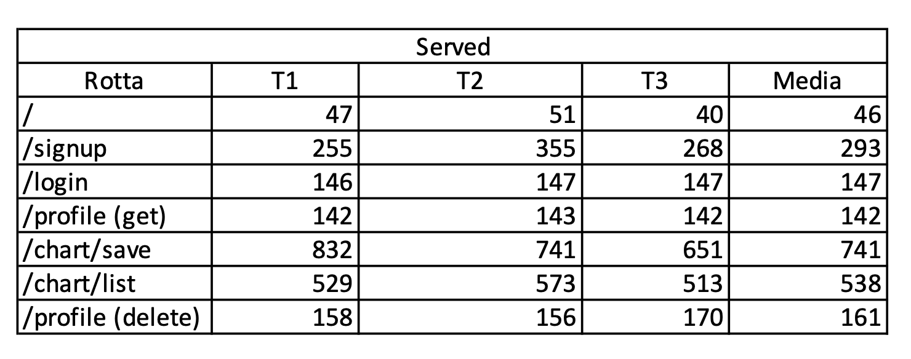
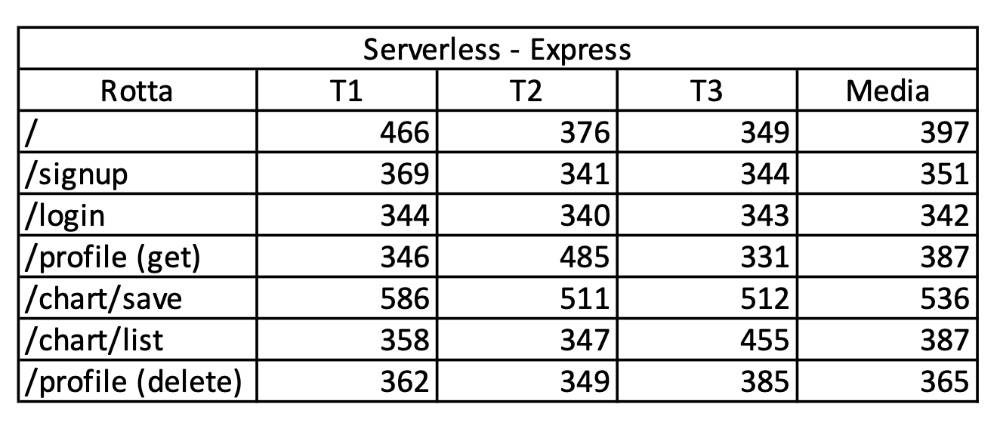
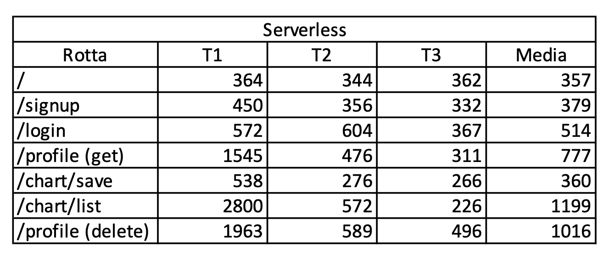
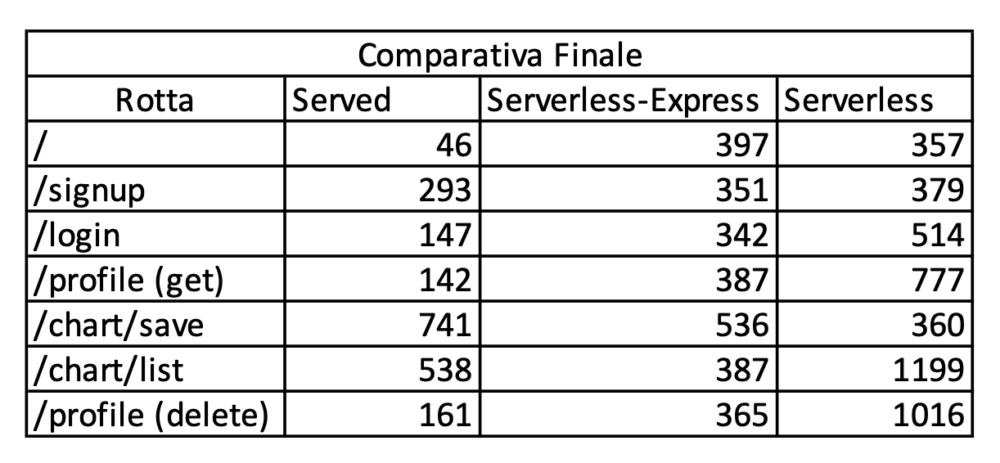

# API RESTful served e API RESTful in soluzioni serverless

## Sommario

### <a href="#introduzione"> Introduzione </a>
- #### <a href="#api">API</a>
- #### <a href="#cloud-computing">Cloud Computing</a>
- #### <a href="#serverless-computing">Serverless Computing</a>
### <a href="#obiettivi"> Obiettivi </a>
### <a href="#strumenti"> Strumenti </a>
### <a href="#architettura"> Architettura </a>
- #### <a href="#parti-comuni"> Parti Comuni </a>
  - ##### <a href="#connessione-al-database"> Connessione al database </a>
  - ##### <a href="#model"> Model </a>
  - ##### <a href="#recupero-e-salvataggio-grafici"> Recupero e salvataggio grafici </a>
  - ##### <a href="#google-charts"> Google Charts </a>
  - ##### <a href="#served"> AWS SDK </a>
  - ##### <a href="#librerie-secondarie"> Librerie Secondarie </a>
- #### <a href="#served"> Served </a>
- #### <a href="#serverless-express"> Serverless Express </a>
- #### <a href="#serverless-lambda"> Serverless Lambda  </a>
### <a href="#test"> Test </a>
### <a href="#conclusioni"> Conclusioni </a>

---

## [Introduzione](#introduzione)

Le **API (acronimo di Application Programming Interface)** sono set di definizioni e protocolli con i quali vengono realizzati e integrati software applicativi. Consentono ai prodotti o servizi di comunicare con altri prodotti o servizi senza sapere come vengono implementati, semplificando così lo sviluppo delle applicazioni e consentendo un netto risparmio di tempo e denaro.

Talvolta vengono concepite come una forma di contratto, con una documentazione che rappresenta un accordo tra le parti: se la parte A invia una richiesta remota strutturata in un determinato modo, il software della parte B risponderà in un altro modo determinato.

Possiamo parlare di API in molti ambiti della programmazione, partendo dalle API di un S.O, fino alle **API Web**, argomento di questa trattazione. 

Con la diffusione delle API Web, sono stati introdotti i primi protocolli e architetture; tra le più diffuse abbiamo: **SOAP e REST**.

Quando si parla di **REST (acronimo di Representational State Transfer)**, ci si riferisce ad un’architettura software, introdotta nel 2000 all’interno della tesi di dottorato di **Roy Fielding**.  Questo approccio architetturale venne ideato per creare web API funzionanti sul protocollo *HTTP*, in realtà funzionano anche su altri protocolli come *SNMP* o *SMTP*.

L’architettura REST si declina in una serie di vincoli e principi stabiliti dallo stesso Roy Fielding:
-	**Client-server**: separazione e definizione dei compiti tra client e server.
-	**Stateless**: principio che si basa sull’assenza di stato nella comunicazione tra client e server. Ogni richiesta deve necessariamente contenere tutte le informazioni per poter essere evasa, ogni sessione è unica e non può essere correlata con altre.
-	**Cacheable**: si può predisporre un meccanismo di cache, in questo caso, le risposte del server devono essere esplicitamente indicate come memorizzabili nella cache. Evitando così i classici problemi legati alla memoria cache.
-	**Layered system**: i componenti del sistema non possono "vedere" oltre il loro strato. Quindi, si possono facilmente aggiungere bilanciatori di carico e proxy per migliorare la sicurezza o le prestazioni.
-	**Uniform interface**: è il vincolo più importante, un'interfaccia uniforme tra i componenti in modo che le informazioni siano trasferite in forma standard. Questo prevede che:
    *	le risorse richieste siano identificabili e separate dalle rappresentazioni inviate al cliente.
    *	le risorse possano essere manipolate dal cliente attraverso la rappresentazione che riceve, perché essa contiene informazioni sufficienti per farlo.
    *	i messaggi autodescrittivi restituiti al cliente hanno informazioni sufficienti per descrivere come trattarli.
    *	L'ipertesto/ipermedia come motore dello stato dell'applicazione: accedendo alla risorsa, il client REST deve poter individuare, attraverso hyperlink, tutte le altre azioni disponibili al momento.
-	**Code on demand**: la possibilità di inviare codice eseguibile dal server al client quando richiesto, estendendo le funzionalità del client.

REST è un insieme di principi architetturali, non un protocollo né uno standard, quindi chi sviluppa API può implementare i principi REST in diversi modi.

Un punto molto importante da chiarire è che ***REST e RESTful*** non sono esattamente la stessa cosa: REST rappresenta l’architettura, mentre RESTful rappresenta tutto ciò che viene sviluppato seguendo i principi dell’architettura REST. 

Sebbene l’API REST debba essere conforme a questi criteri, il suo impiego è più semplice rispetto a quello di un protocollo come SOAP (Simple Object Access Protocol), che presenta requisiti specifici come la messaggistica XML e la conformità integrata di sicurezza e transazione, rendendo il tutto più lento e pesante. 

Essendo i vincoli delle API REST meno stringenti e di conseguenza più semplici da applicare, le API REST sono ottime per scenari come l’**IoT** e lo sviluppo di **applicazioni mobile**.

Questo progetto presenta due tipi di API REST:
 - **served**: si intende un’API RESTful messa in produzione su un server, occupandosi, oltre al processo di deploy dell’API, anche della configurazione e manutenzione del server web.
 - **serverless**: per parlare di API REST in soluzioni serverless abbiamo bisogno di approfondire il concetto di cloud computing e successivamente serverless computing.

### [Cloud computing](#cloud-computing)

Esistono diverse definizioni di cloud computing, è difficile stabilire quale è corretta e quale no perché ognuna di esse rappresenta una parte del cloud computing.

Una prima definizione è la seguente: 
> Commercializzazione di risorse di calcolo, storage on-demand e consumo di risorse "pay-as-you-go".

Il National Institute of Standards and Technology(NIST), definisce il cloud computing come segue: 
> "Il cloud computing è un modello che permette l'accesso ubiquo, adattivo e su richiesta a risorse informatiche condivise e configurabili (reti, server, applicazioni, storage e servizi) che possono essere fornite e rilasciate con il minimo sforzo e interazione con il fornitore di servizi."

Abbiamo inifine la definizione dell'Università di Berkeley: 
> Il cloud computing si riferisce alle applicazioni fornite come servizio su Internet, come l'hardware e il software nei centri dati che forniscono questi servizi.
Quest'ultima è stata poi classificata come il modello SaaS che vedremo in seguito.

L'utilizzo del cloud computing è diventato una realtà stabile grazie all’incremento vertiginoso della potenza di calcolo ed al miglioramento dei **sistemi di virtualizzazione**.

Esistono diversi modelli di cloud computing:
-	**SaaS** (software as a service): ad esempio Office 365, Gmail, l'accesso al software avviene tramite internet ed i dati sono salvati in cloud.
-	**IaaS** (infrastucture as a service): l’infrastruttura è un servizio, in pochi secondi è possibile creare una macchina virtuale per le proprie esigenze.
-	**PaaS** (platform as a service): non si richiede una macchina virtuale ma direttamente un web server, in sostanza viene richiesto direttamente quello che è necessario (senza preoccuparsi della configurazione del resto).
-	**BaaS** (backend as a service): ad esempio login con Facebook, permette di usare un servizio di un'altra applicazione, interfacciandosi tramite API. 
-	**FaaS** (function as a service): il codice viene organizzato in funzioni, ogni funzione è invocabile tramite evento. Le funzioni sono atomiche, svolgono un singolo lavoro e non devono mai restare in attesa.   

Il cloud computing presenta molti vantaggi rispetto l'impiego di server on-premise:
- aggiungere o togliere capacità (di calcolo o storage) all'infrastruttura cloud quando se ne ha bisogno, disponibile in pochi minuti;
- non c'è bisogno di preoccuparsi dell'hardware sottostante, anche se si rompe, nel qual caso gli strumenti cloud hanno piani di disaster recovery automatici;
- non si paga la manutenzione e l'elettricità che non si usa. Si paga solo la parte che serve e che è realmente utilizzata, massimizzando l'efficienza dello spazio fisico richiesto per soddisfare le esigenze informatiche.
- Inoltre non si paga per un rack di server con la maggior parte dei cicli di CPU inattivi e che consumano elettricità.
  
### [Serverless computing](#serverless-computing)

Con serverless computing si intende un modello di sviluppo cloud nativo che permette agli sviluppatori di creare e rendere eseguibili le applicazioni senza gestire i server, o meglio, i server vengono utilizzati ma sono astratti dallo sviluppo delle app. In pratica, con il serverless computing si delega a un vendor l’esecuzione del codice lato server. Il modello FaaS del cloud computing è quello che si sposa meglio con il serverless computing. 

Il modello serverless è diverso dagli altri modelli di cloud computing, poiché il provider di servizi cloud è responsabile di gestire sia l'infrastruttura cloud che la scalabilità delle app. Le app serverless vengono distribuite in container che vengono avviati on demand al momento della chiamata.

## [Obiettivi](#obiettivi)

L'obiettivo principale di questo documento è confrontare API RESTful served e serverless.
Per quanto riguarda le API RESTful serverless vengono proposti due modelli con differenze sostanziali.

Il confronto, qualitativo e quantitativo, è articolato in quattro punti:
- tempistiche e complessità di sviluppo;
- costo di deploy e mantenimento;
- problematiche e vantaggi legati agli aggiornamenti;
- affidabilità e sicurezza;
- prestazioni.

## [Strumenti](#strumenti)

Tutti gli strumenti utilizzati per lo sviluppo del progetto sono open source o gratuiti. 

L'editor scelto per lo sviluppo è [Visual Studio Code](https://code.visualstudio.com), con i seguenti plugin:
- [Javascript ES6 Code Snippets](https://marketplace.visualstudio.com/items?itemName=xabikos.JavaScriptSnippets);
- [Typescript](https://marketplace.visualstudio.com/items?itemName=ms-vscode.vscode-typescript-next);
- [Yaml](https://marketplace.visualstudio.com/items?itemName=redhat.vscode-yaml);
- [Markdown](https://marketplace.visualstudio.com/items?itemName=yzhang.markdown-all-in-one);

L'intero progetto è stato sviluppato in [Typescript](https://www.typescriptlang.org), la scelta di Typescript al posto di Javascript è motivata da una compatibilità maggiore da parte del linguaggio di casa Microsoft e da un miglior controllo degli errori grazie alla tipizzazione.

Il framework alla base è [NodeJS](https://nodejs.org/en/), con il gestore di pacchetti [NPM](https://www.npmjs.com).

Nella versione served, è stato utilizzato un server VPS, attivato su [Aruba](https://www.cloud.it/vps/vps-hosting.aspx), con 1vCPU, 2GB di ram e un uptime garantito del 99,8%.
Il sistema operativo del server è [Debian](https://www.debian.org) e come web server è stato utilizzato [Nginx](https://nginx.org/en/#basic_http_features). Quest'ultimo è stato configurato come reverse proxy e server block.

Nelle prime due versioni delle API RESTful (server e serverless-express), è stata usata la libreria [Express](https://expressjs.com) per la gestione del routing interno all'applicazione.

Per le versioni serverless, è stato usato il framework SERVERLESS.
Questa scelta è stata fatta per garantire una maggiore compatibilità tra i vari vendor, [SERVERLESS](https://www.serverless.com) permette di effettuare il deploy sui vendor più conosciuti, cambiando poche righe nel file di configurazione serverless.yml.

Il vendor scelto per effettuare i test è AWS, quest'ultimo offre moltissimi servizi rivolti al cloud computing. 
In questo caso vengono usati:
  - [API GATEWAY](https://aws.amazon.com/it/api-gateway/), per la gestione delle richieste HTTP;
  - [AWS LAMBDA](https://aws.amazon.com/it/lambda/?nc2=type_a), per l'esecuzione vera e propria del codice;
  - [AWS S3](https://aws.amazon.com/it/s3/faqs/), come storage per il caricamento del codice al momento del deploy e per salvare i dati dell'utente.

Il database usato per l'autenticazione è un [MongoDB](https://www.mongodb.com/it), in cloud su [Mongo Atlas](https://www.mongodb.com/cloud/atlas) e la tecnologia alla base dell'autenticazione è [JWT](https://jwt.io).

La gestione del JWT presenta diversi problemi:
- il furto del token consente al ladro di impossessarsi, per il tempo di validità del token, dell'identità dell'utente;
- il token ha un tempo di vita stabilito, se l'utente cessa le richieste prima di questa scadenza, il token rimane comunque valido. Questa problematica rende difficile il controllo dei token, per arginarla possono essere usati due metodi:
  -  memorizzare i token validi all'interno del database ed al momento del logout dell'utente eliminare il token dal database. Anche se il token venisse rubato, al controllo successivo otterremo un JWT valido ma non presente nella lista dei token attivi, quindi verrebbe scartato;
  -  memorizzare i token invalidati in seguito al logout, fino alla scadenza effettiva del token. Questa tecnica è complementare alla precedente ma richiede un ulteriore lavoro per il confronto tra il token invalidato e l'effettiva scadenza del token.
  
Questo processo effettua in un certo senso un doppio controllo, richiedendo ovviamente più risorse e tempo ma garantendo una migliore sicurezza. Ai fini dell'applicazione proposta, non essendo la sicurezza il core dell'applicazione, si è scelto di utilizzare il controllo singolo sul JWT. 

Per gestire il database dal computer di sviluppo è stato utilizzando [Mongo Compass](https://www.mongodb.com/products/compass).

Infine, vengono utilizzate le API di [Google Chart](https://developers.google.com/chart/image/docs/making_charts) che vengono consulate tramite chiamate HTTP e restituiscono l'immagine desiderata.

Per testare l'applicazione è stato utilizzato il software [Postman](https://www.postman.com), quest'ultimo permette di effettuare chiamate HTTP, con eventuale passaggio di parametri, restituendo e visualizzando la risposta ottenuta dal server.

## [Architettura](#architettura)

Il progetto presenta tre architetture che perseguono lo stesso obiettivo, ognuna a suo modo.

Il flusso dell'applicazione permette la registrazione degli utenti per mezzo di email e password ed il login con i dati scelti.

Una volta loggato, l'utente può accedere alle rotte protette dal middleware legato all'autenticazione, nello specifico queste rotte sono: 
- profilo: permette di recuperare i dati del profilo dell'utente;
- eliminazione del profilo: elimina tutti i dati collegati all'utente;
- generazione e salvataggio di un grafico;
- lista di tutti i grafici dell'utente.

C'è poi la rotta di "servizio" che permette di verificare se l'applicazione è online.

All'interno del codice sono state documentate tutte le rotte e per ognuna di esse, viene specificato il metodo ed i parametri necessari per chiamarla.

Le tre architetture proposte sono:
- Served 
- Serverless Express
- Serverless Lambda

Svolgendo l'applicazione gli stessi compiti in tutte le soluzioni proposte, ci sono alcune parti in comune.

### [Connessione al database](#connessione-al-database)

La gestione della connessione al database è affidata a [Mongoose](https://mongoosejs.com), un **Object Data Mapper** che utilizza il driver di MongoDB e lo astrae per facilitare la connessione. 

Nel file `database.ts` vengono esportante le funzioni `connect()` e `disconnect()`, la prima prende i parametri dal file `config.ts` e stabilisce la connessione con il dabatase, la seconda si occupa della chiusura della connessione.

### [Model](#model)

Tramite Mongoose è possibile definire degli oggetti che mappano un documento MongoDB.
All'interno dell'applicazione è stato usato per definire lo schema ed il modello dell'utente:

`const UserSchema = new Mongoose.Schema({
  _id: String,
  password: String,
});` 

`export const UserModel = Mongoose.model<IUser>(
  "user",
  UserSchema
) as IUserModel;`

Tramite lo schema ed il modello è possibile istanziare oggetti ***User*** ed utilizzarli per il processo di autenticazione.

### [Recupero e salvataggio dei grafici](#recupero-e-salvataggio-dei-grafici)

Nell'ottica dei ***microservizi***, per la creazione e lo storage dei grafici sono stati utilizzati servizi esterni, rispettivamente: 
- Google Charts
- AWS S3

#### [Google Charts](#google-charts)

#### [AWS SDK](#aws-sdk)

### [Served](#served)

Quest'architettura è in un certo senso la più "classica", prevede l'utilizzo di un server personale ed un web server per rendere disponibili le API. Come specificato nella sezione strumenti, in quest'esempio è stato utilizzato un VPS con Debian e Nginx.

Il flusso dell'applicazione in questo caso prevede che l'utente effettui una richiesta, ad esempio:

`http://cer.eliapacioni.cloud/`

La richiesta viene ricevuta dal web server sulla porta 80. A questo punto, essendo Nginx configurato come server block e reverse proxy, instrada la richiesta all'applicazione collegata al blocco `cer` e la inoltra alla porta **3000** su cui è in ascolto l'applicazione Nodejs.

L'applicazione passa la richiesta alla libreria **Express** che la incapsula nell'oggetto **Request** e tramite il proprio router interno invoca la rotta desiderata, nel nostro esempio la rotta '**/**' che abbiamo definito come rotta di servizio per verificare lo stato dell'applicazione.

Il risultato di questa consultazione è incapsulato nell'oggetto **Response** ed inviato al client sotto forma di **JSON**.

Il flusso appena descritto è valido per le rotte che non richiedono l'autenticazione, nel caso di rotte autenticate è necessario passare attraverso il middleware **authentication**.

In questo caso, dopo aver incapsulato la richiesta nell'oggetto **Request**, verrà invocato subito il middleware per verificare il **JWT** dell'utente. Se il token passato dall'utente è valido, l'esecuzione prosegue con il passo seguente ed invoca la rotta richiesta; se il token è scaduto o non valido, l'esecuzione viene bloccata e viene restituito, tramite l'oggetto **Response**, l'errore `401`.

Il **JWT** contiene anche l'id dell'utente, quindi passando il token abbiamo tutto ciò che ci serve riguardo l'utente che sta effettuando la richiesta. Per questo motivo nelle rotte riguardanti il profilo o nella lista dei grafici dell'utente, non è necessario passare altro oltre il token. Questi dati vengono iniettati attraverso il middleware **authentication** nell'oggetto **Request** di Express, per consentire quest'iniezioni di dati è necessario modificare l'oggetto **Request** definendo i campi aggiuntivi necessari: 

`declare global { 
  namespace Express { 
    interface Request { 
      decoded?: any, 
      input_files?: any 
      } 
    } 
  }`

Tale modifica è richiesta dall'utilizzo di Typescript, nel caso di Javascript, non essendo effettuato alcun controllo sui tipi, avremmo potuto effettuare una semplice assegnazione.
In Typescript, se non viene specificata la proprietà, al momento dell'assegnazione verrà sollevata un'eccezione e restituirà un errore.

#### Deploy
 
In un'archiettura served, per effettuare il deploy è necessario:
- configurare il sistema: installando i linguaggi ed i moduli necessari all'applicazione, nel caso di un server condiviso tra più applicazioni è necessario verificare la compatibilità/incompatibilità con i pacchetti di altre applicazioni;
- web server: creare il **server block** dell'applicazione e configurarlo per ascoltare ed indirizzare sulle porte desiderate;
- caricare il codice dell'applicazione desiderata nella cartella a cui punta il server block;
- installare le librerie ed i pacchetti collegati alla nostra applicazione.

#### Aggiornamento

Al momento dell'aggiornamento dell'applicazione è necessario interrompere l'intera applicazione, a causa della struttura monolitica. Solo alla fine dell'aggiornamento verrà resa nuovamente disponibile l'applicazione.

Questa procedura viene spesso evitata attraverso l'utilizzo di server temporanei, quest'ultima soluzione prevede l'utilizzo di un server su cui configurare temporanemente l'intera applicazione e a cui far puntare il dominio per il tempo necessario all'aggiornamento. Infine puntare il dominio al server aggiornato ed eliminare il server temporaneo.

Questa soluzione è efficace ma presenta costi elevati dovuti all'utilizzo di più macchine ed ai tempi di configurazione necessari per entrambi i server.

Ad ogni modo, un downtime, anche se minimo, sarà sempre presente.

#### Affidabilità e sicurezza
L'affidabilità della nostra applicazione è legata alla struttura su cui la stiamo eseguendo e che dobbiamo direttamente gestire. Quindi è intrinsecamente legata alla preparazione del team che mantiene il progetto.

#### Prestazioni
Le prestazioni possono essere ottime e dipendono direttamente sulla macchina o sul cluster dove l'applicazione viene eseguita. 
Ipotizzando di avere un server dedicato solo ad una singola applicazione, le prestazioni saranno massime. Spesso non verranno sfruttate interamente le caratteristiche della macchina perché l'applicazione potrebbe non richiedere tutta la potenza di calcolo o memoria messa a disposizione.

La scabilità è affidata al sistemista del progetto e può essere:
- verticale: potenziando il singolo server;
- orizzontale: predisponendo manualmente un cluster su cui eseguire l'applicazione.

Ad ogni modo, è limitata alle risorse acquistate o noleggiate dall'azienda. 

### [Serverless Express](#serverless-express)

La prima versione ***serverless*** del progetto è basata sulla versione ***served***, implementando il framework serverless per il deploy su aws.

`import serverless from 'serverless-http';`

...

`module.exports.handler = serverless(app);`

### [Serverless Lambda](#serverless-lambda)
  
## [Test](#test)

I test sono stati condotti con l'utilizzo dell'applicazione Postman che permette di effettuare chiamate HTTP e visualizzare la risposta del server.

Allegato al progetto è presente il file contenente le chiamate HTTP di test, con i relativi parametri. 
Il file (`chiamate_api_test.postman_collection.json`) contiene tutto il necessario per riprodurre in modo indipendente la simulazione e verificare i dati trascritti nelle tabelle di seguito.

Il test eseguito è di tipo prestazione, incentrato sul tempo di evasione della richiesta nelle varie architetture.

RICORDARE IL DISCORSO DELLA CACHE NEL SERVERLESS E FAR NOTARE LA DIFFERENZA TRA LA PRIMA E LA 3 CHIAMATA.
NEL SERVERLESS-EXPRESS TUTTA L'APP è MESSA IN CACHE, NELL'ALTRA SOLO LE SINGOLE FUNZIONI USATE.

## [Conclusioni](#conclusioni)